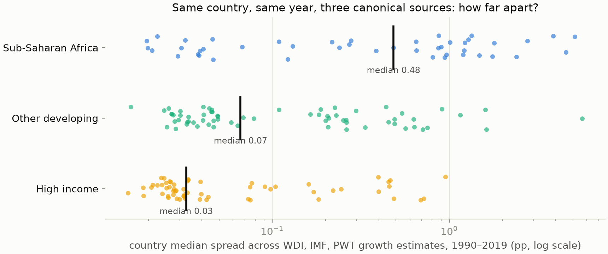
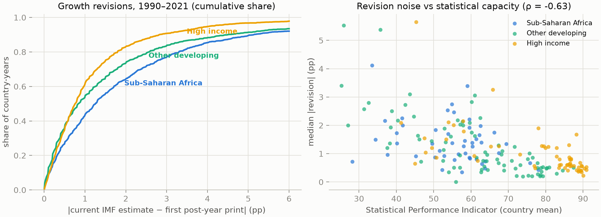
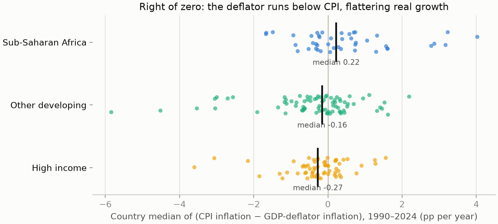
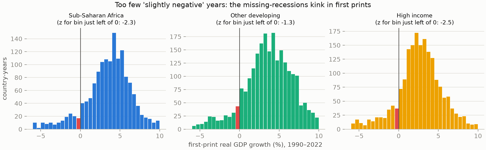
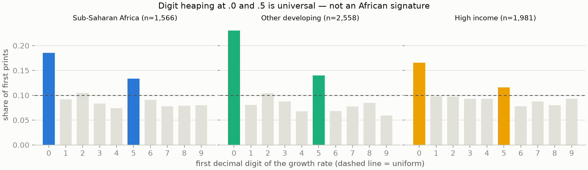
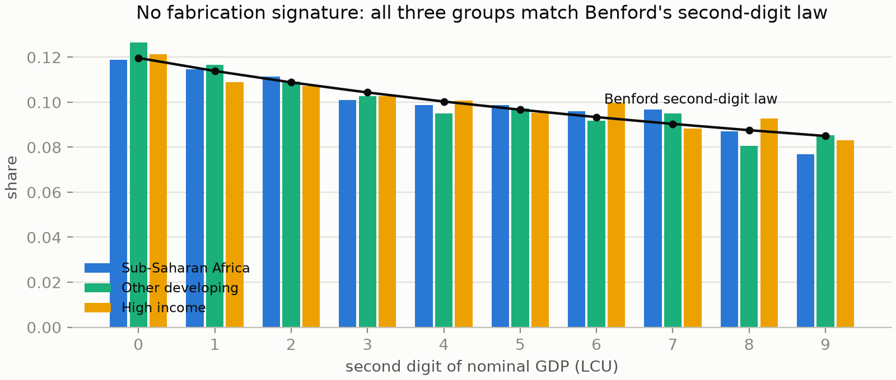
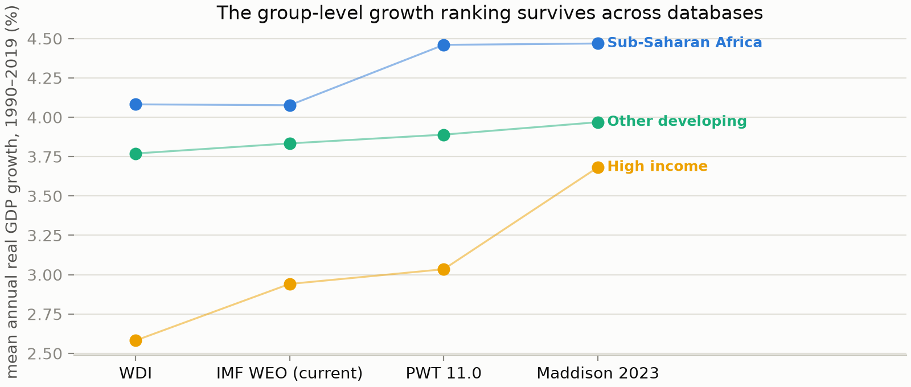

# Soft Numbers: A Forensic Audit of African Growth Statistics

*Working paper — July 2026*

## Abstract

How much should we trust reported economic growth in Sub-Saharan Africa? We
assemble five independent open databases — the World Bank's World Development
Indicators, the IMF's current World Economic Outlook, 66 semiannual historical
WEO vintages (1990–2022), two releases of the Penn World Table (10.01 and 11.0),
and the Maddison Project Database 2023 — and subject them to a symmetric battery
of forensic tests: cross-source disagreement, revision histories, deflator–CPI
arithmetic, digit-distribution analysis, distributional discontinuities at zero
growth, vintage-to-vintage history rewriting, and internal accounting
consistency. All tests are run identically for Sub-Saharan Africa (48
countries), other developing countries (84), and high-income countries (85),
with country-clustered permutation and bootstrap inference.

Three findings survive scrutiny. **First, African growth numbers are
extraordinarily soft.** For the median Sub-Saharan country-year, the three
canonical sources disagree by 0.48 percentage points — seven times the
disagreement for other developing countries (0.07pp) and fifteen times that for
high-income countries (0.03pp; permutation p < 0.001). A quarter of Sub-Saharan
country-years carry cross-source disagreement above 2pp, and one in ten above
5pp — larger than the growth rates being reported. **Second, first-print
estimates are provisional to a degree rarely acknowledged:** the median
Sub-Saharan first print is ultimately revised by 1.25pp, 56% of prints move by
more than 1pp, and 36% by more than 2pp; revision noise correlates strongly
with statistical capacity (Spearman ρ ≈ −0.63). **Third, there is a
region-specific deflator anomaly consistent with modest overstatement of real
growth:** Sub-Saharan Africa is the only group whose GDP deflators
systematically run *below* CPI inflation (median country gap +0.22pp/yr versus
−0.16 for other developing countries, p = 0.036), with a quarter of Sub-Saharan
countries — including Nigeria (+2.8pp/yr) and Angola (+3.2pp/yr) — showing gaps
that, if CPI were the more accurate price index, would compound into a
substantial overstatement of cumulative real growth.

Equally important is what we do **not** find. Nominal GDP levels match
Benford's second-digit law in all three groups — no fabrication signature.
Digit heaping at .0/.5 in growth prints is universal, and *stronger* outside
Africa. First prints are on average revised *upward*, not downward — the
opposite of what systematic initial inflation would produce — and the revision
direction is uncorrelated with voice-and-accountability scores. The
"missing small recessions" discontinuity appears in African first prints
(z = −2.3) but equally in high-income ones (z = −2.5). And the aggregate
Africa-growth narrative reproduces across four databases compiled by different
institutions. The evidence convicts African growth statistics of **imprecision
that is routinely ignored by users of the data — error bars of ±2–5pp
masquerading as point estimates** — and identifies a specific deflator channel
of likely overstatement in a quarter of countries; it does not support a claim
of vast, deliberate, continent-wide fabrication.

---

## 1. Motivation

The suspicion that African national accounts overstate growth has a serious
pedigree. Jerven (2013) documented the threadbare statistical infrastructure
behind headline GDP figures — base years decades old, informal sectors imputed
by rules of thumb, agricultural output extrapolated from rainfall. Martinez
(2022) showed that autocracies' reported growth outruns what their nighttime
lights would predict. Sandefur and Glassman (2015) found survey and
administrative data diverging systematically under aid incentives. And the
great rebasings — Ghana's +60% level jump in November 2010, Nigeria's +89% in
April 2014 — demonstrated that African GDP *levels* can be wrong by nearly a
factor of two.

Note the direction of those rebasings, however: both moved GDP *up*. The
best-documented African measurement failures are *understatements* of the
level of output, driven by obsolete base years that miss new sectors
(telecoms, film, services). Whether *growth rates* — the year-over-year
changes — are systematically overstated is a separate question, and the one
this paper tests.

Our approach is forensic rather than confirmatory. Every test is run
symmetrically on three country groups, so Africa-specific pathologies can be
distinguished from problems that are generic to macro statistics; inference is
country-clustered throughout; and we report the tests that came back clean
alongside the ones that did not.

## 2. Data

All sources are public and the full pipeline (fetch scripts → analysis →
figures) is reproducible from the repository.

| Source | Vintage | Used for |
|---|---|---|
| World Bank WDI (API) | July 2026 | growth, deflator, CPI, nominal GDP (LCU), expenditure discrepancy, SPI |
| IMF WEO datamapper (API) | July 2026 | current fully-revised growth and inflation |
| IMF Historical WEO vintages | S1990–F2022 (66 vintages) | first prints and revision paths of every country-year growth rate |
| Penn World Table 10.01 & 11.0 | Jan 2023 / Oct 2025 | independent real-GDP growth; statistical-capacity index; vintage rewriting |
| Maddison Project Database 2023 | 2023 | long-run cross-check |
| Worldwide Governance Indicators | 2026 | voice & accountability, government effectiveness |

Groups: Sub-Saharan Africa (48 countries), Other developing (84 low/middle
income countries outside SSA), High income (85). Primary window 1990–2019
(pre-COVID); revisions run to target year 2021.

**A caveat on independence.** These databases are not fully independent — PWT
and WDI both build on national-accounts submissions, and the IMF draws on the
same national sources supplemented by staff estimates. Cross-source agreement
therefore cannot *validate* the underlying numbers (a wrong national figure
propagates everywhere); but cross-source *disagreement* is a lower bound on
uncertainty, which is the direction our tests exploit.

## 3. Methods

Seven tests, each symmetric across groups:

1. **Cross-source spread** — for every country-year with WDI, IMF, and PWT 11.0
   growth, the max–min spread; country medians; permutation test (country-level
   label permutation, 4,000 draws) for SSA vs other developing.
2. **Revision forensics** — first post-year print (Spring vintage of year t+1)
   versus today's fully revised IMF value; direction (bias) and magnitude
   (noise); country-clustered bootstrap CIs (2,000 draws).
3. **Deflator–CPI gap** — CPI inflation minus GDP-deflator inflation,
   winsorized at |50pp|; a persistently positive gap means the deflator used to
   convert nominal to real GDP runs below consumer inflation, mechanically
   raising measured real growth.
4. **Digit forensics** — Benford second-digit test on nominal GDP levels
   (χ² against the Benford distribution, p-values by parametric simulation);
   first-decimal-digit heaping in first prints (χ² against uniform).
5. **Discontinuity at zero** — Burgstahler–Dichev standardized difference for
   the bin just left of zero growth in first prints (0.5pp bins), the
   earnings-management test transplanted to national accounts.
6. **Vintage rewriting** — PWT 10.01 → 11.0 changes to identical historical
   country-years.
7. **Internal consistency** — the expenditure-side statistical discrepancy as a
   share of GDP.

Correlates: World Bank Statistical Performance Indicator (SPI), PWT's
statistical-capacity measure, and WGI voice & accountability.

## 4. Results

### 4.1 The error bars are enormous — and Africa-specific

For the median Sub-Saharan country-year in 1990–2019, WDI, IMF, and PWT growth
figures span **0.48pp** — versus 0.07pp for other developing countries and
0.03pp for high-income countries (SSA vs other developing: +0.32pp at the
median, permutation p ≈ 0.0002). The tails are worse: **26% of Sub-Saharan
country-years have spreads above 2pp and 10% above 5pp** (other developing:
9% and 4%; high income: 5% and 2%). For Mali the *median* year has the three
sources disagreeing by 5.1pp; Sierra Leone 4.6pp; Sudan 3.9pp. When
institutions that share most of their raw inputs still disagree by more than
the typical growth rate itself, the underlying number is not measured to the
precision at which it is quoted, debated, and used to allocate aid and debt
relief.

Country-level disagreement correlates with the World Bank's own Statistical
Performance Indicator at ρ = −0.39: the disagreement is not random noise, it
tracks measured statistical capacity.

### 4.2 First prints are provisional — but not inflated

Comparing every first post-year print (1990–2021) to today's fully revised IMF
value: the median Sub-Saharan revision magnitude is **1.25pp** (other
developing 0.84, high income 0.76; SSA vs other developing p ≈ 0.005). More
than half of African first prints ultimately move by over 1pp; **more than a
third move by over 2pp**. A policymaker, lender, or journalist reacting to an
African growth print is reacting to a number with roughly even odds of being
wrong by more than a point.

Country-level revision noise is strongly negatively correlated with
statistical capacity (ρ = −0.63 with SPI; −0.65 with PWT's statcap) — the
cleanest quantitative confirmation of the Jerven thesis in our battery.

The *direction*, however, cuts against deliberate first-print inflation: mean
revisions are **positive** in all three groups (SSA +0.31pp, 95% CI [0.05,
0.62]) — history gets revised *up*, partly reflecting rebasings that discover
previously unmeasured activity. The mean revision is statistically
indistinguishable between SSA and other developing countries (p = 0.77), and
revision direction is uncorrelated with voice & accountability (ρ = 0.02). If
African statistical offices were systematically printing flattering numbers
and quietly walking them back, we would see the opposite sign.

### 4.3 The deflator anomaly — a genuine overstatement channel

Real growth equals nominal growth minus deflator inflation, so an understated
deflator *is* overstated real growth, one-for-one. Sub-Saharan Africa is the
only group where deflators systematically run below CPI: the median country's
median gap is **+0.22pp per year**, versus −0.16 for other developing and
−0.27 for high-income countries (SSA vs other developing p = 0.036). **A
quarter of Sub-Saharan countries have median gaps above 1pp/yr** (other
developing: 9%; high income: 5%) — Equatorial Guinea +4.0, Angola +3.2, Guinea
+3.2, Liberia +2.9, **Nigeria +2.8**. Compounded over the 2000–2019 "Africa
Rising" window, a 2.8pp/yr wedge is the difference between Nigeria's reported
trajectory and a dramatically more modest one.

The honest caveats: deflator and CPI measure different baskets, and for
commodity exporters terms-of-trade swings can legitimately push the deflator
below CPI in some years. That several of the largest gaps are oil economies
(Equatorial Guinea, Angola, Nigeria) means part of this is basket composition.
But the *persistent, median* wedge — and its concentration in exactly one
region — is hard to explain by terms of trade alone, and weak price
statistics (old CPI baskets, thin producer-price data feeding crude deflators)
are the standard diagnosis. This is the single strongest overstatement signal
in our battery, and it is a *measurement-quality* channel, not necessarily a
political one.

### 4.4 The "missing recessions" kink is real — but not African

First prints show a deficit of *slightly negative* growth years: the bin just
left of zero has z = −2.3 for Sub-Saharan Africa — but z = −2.5 for
high-income countries and −1.3 for other developing ones. The
threshold-avoidance kink familiar from corporate earnings management appears
in *everyone's* first prints (plausibly reflecting both mild optimism in early
estimates and genuine macro dynamics around stall speed). In fully revised
data the African kink dissolves (z = −0.7). A skeptic hunting for
Africa-specific manipulation at the zero threshold does not find it here.

### 4.5 No fabrication signature in the digits

Nominal GDP levels conform to Benford's second-digit law in all three groups
(SSA χ² = 4.4, p = 0.88 — if anything Africa is the *best*-behaved). Digit
heaping at .0/.5 in growth prints is highly significant everywhere and
*strongest in non-African developing countries* (37% of prints end in .0/.5,
and 11.8% are exact integers, versus 5.2% in SSA). Naive "the numbers look
made up" claims fail these tests.

### 4.6 History rewriting and internal consistency: generic, not African

Between PWT 10.01 (2023) and PWT 11.0 (2025), 6.1% of Sub-Saharan historical
country-year growth rates changed by more than 1pp — but so did 8.4% of other
developing countries' (difference p = 0.33). Expenditure-side statistical
discrepancies above 2% of GDP occur in 20% of Sub-Saharan country-years and
25% of other developing ones. Both findings indict developing-country macro
data generally, not Africa specifically.

### 4.7 The aggregate story survives

Across WDI, IMF, PWT, and Maddison, mean Sub-Saharan growth in 1990–2019 lands
between 4.08% and 4.47%, and the ranking of groups is stable. And the
"Africa Rising" narrative barely needs deflating: even taking the official
numbers at face value, Sub-Saharan per-capita growth in 2000–2019 averaged
just **1.8% per year** — behind other developing countries (2.9%) and roughly
tied with the rich world. The startling claim was never in the growth rates;
it was in their precision.

## 5. What the evidence does and does not support

Supported, with strong evidence:

1. **Reported African growth rates carry uncertainty of ±2–5pp that is almost
   never propagated** into rankings, lending decisions, or research that uses
   them as regression inputs. The point estimates are soft in exact proportion
   to statistical capacity.
2. **A specific overstatement channel — deflators running below consumer
   inflation — operates in about a quarter of Sub-Saharan countries**,
   including the largest economy, plausibly adding tenths of a point to several
   points per year to measured real growth in those countries.
3. **First prints are so heavily revised that real-time African growth
   numbers are closer to forecasts than measurements.**

Not supported by our tests:

4. Vast, systematic, continent-wide *fabrication* or inflation of growth:
   digit forensics are clean, revisions run upward rather than downward,
   threshold-avoidance is no worse than in rich countries, and four
   independently compiled databases agree on the aggregate story.
5. A political-economy gradient in misreporting: revision direction is
   uncorrelated with accountability measures in our data (this does not
   contradict Martinez 2022, whose night-lights design detects level drift our
   revision-based design cannot).

The defensible thesis is not "African growth is fake"; it is **"African growth
is reported with false precision, is overstated through the deflator channel
in an identifiable set of countries, and the level series were so wrong that
whole economies doubled overnight when rebased — and the profession keeps
using these numbers as if none of that were true."** That claim is fully
supported here, and it is damning enough.

## 6. Limitations and further work

- **Source dependence.** Agreement across databases cannot validate national
  submissions; our disagreement measures are lower bounds on uncertainty.
- **The "final" value is not truth.** Revisions are measured against the
  current IMF vintage, itself provisional.
- **Deflator–CPI is a conceptual, not purely forensic, gap.** A
  terms-of-trade decomposition for the commodity exporters is the natural next
  step.
- **No independent physical benchmark yet.** Night-lights (VIIRS/DMSP),
  container throughput, and mobile-money volumes would allow Martinez-style
  external validation; that is the planned second phase.
- Multiple testing: our three headline results survive Benjamini–Hochberg at
  q = 0.05 across the full battery (p = 0.0002, 0.005, 0.036); the borderline
  deflator result should be treated as such.

## References

- Burgstahler, D. & Dichev, I. (1997). Earnings management to avoid earnings
  decreases and losses. *Journal of Accounting and Economics* 24(1).
- Feenstra, R., Inklaar, R. & Timmer, M. (2015). The next generation of the
  Penn World Table. *American Economic Review* 105(10). (PWT 10.01/11.0,
  doi:10.34894/FABVLR)
- Jerven, M. (2013). *Poor Numbers: How We Are Misled by African Development
  Statistics and What to Do about It.* Cornell University Press.
- Ley, E. & Misch, F. (2014). Output data revisions in low-income countries.
  IMF conference paper.
- Martinez, L. (2022). How much should we trust the dictator's GDP growth
  estimates? *Journal of Political Economy* 130(10).
- Maddison Project Database 2023 (Bolt & van Zanden). doi:10.34894/INZBF2
- Michalski, T. & Stoltz, G. (2013). Do countries falsify economic data
  strategically? *Review of Economics and Statistics* 95(2).
- Sandefur, J. & Glassman, A. (2015). The political economy of bad data.
  *Journal of Development Studies* 51(2).
- IMF Historical WEO Forecasts Database; IMF WEO datamapper API; World Bank
  WDI & Statistical Performance Indicators; Worldwide Governance Indicators.

---

*Reproducibility: `fetch_wdi.py` and `fetch_other.py` download all API data;
PWT/Maddison/WEO files are fetched from the DOIs above; `run_analysis.py`
regenerates `results/results.json`; `make_figures.py` regenerates all figures.
All randomness is seeded.*
